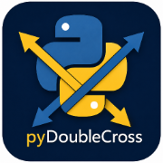

<p align="center">
  
</p>

# pyDoubleCross

Validate data consistency between a source and a target data source (MS SQL Server, Azure SQL,
PostgreSQL, MySQL, Oracle, SQLite, DuckDB today; S3/Iceberg/Databricks planned).

Each named **validation item** pairs a source and a target data source definition (connection +
query), compares the results by key column using [Great Expectations](https://greatexpectations.io/)
and pandas-based row/value diffing, and produces a report exportable to Excel. Each data source
reference can independently cache its fetched data, with per-run override/force-refresh support.

Runs three ways from one codebase:

- **CLI** (`pydoublecross ...`)
- **REST API** (FastAPI)
- **Web UI** (server-rendered, same process as the API — bind to `127.0.0.1` for single-machine
  use, or `0.0.0.0` to expose it)

## Quickstart

```bash
uv sync
uv run pydoublecross validate-config -c config/example.yaml
uv run pydoublecross list -c config/example.yaml
```

`config/example.yaml`'s one validation item (`customer_count_check`) points at two SQLite/DuckDB
files that don't exist yet (`./examples/legacy.db`, `./examples/warehouse.duckdb`) — create them
first, or use your own config, before `run`/`serve` will have data to compare. See
[Getting Started](docs/getting-started.md) for a full self-contained walkthrough.

See [docs/](docs/index.md) (`uv run mkdocs serve`) for configuration, data source, caching,
validation, and API/web reference.

## Development

```bash
uv sync
uv run ruff check .
uv run ty check
uv run pytest
```

Versioning is CalVer + git hash: `YYYY.MM.MICRO+<sha>` (e.g. `2026.7.2+a1b2c3d`), bumped and
released automatically on every merge to `master` — see
[Versioning](docs/development.md#versioning) and [Releasing](docs/development.md#releasing).

## License

Licensed under the [Apache License, Version 2.0](LICENSE) (see also [NOTICE](NOTICE)). You may
not use this project except in compliance with the License; a copy is included in this repository
and at <http://www.apache.org/licenses/LICENSE-2.0>.

## About this project

pyDoubleCross's initial implementation — project scaffolding, application code, tests, and
documentation — was generated by [Claude](https://www.anthropic.com/claude) (Anthropic's AI
model), operating as [Claude Code](https://claude.com/product/claude-code), under the direction
and review of James G Willmore. See [NOTICE](NOTICE) for details.
